---
---

What is it?
===========

Level up! is a [gamification plugin]({{ site.moodle_url }}) for Moodle. It allows students to earn experience points and level up as they participate in the courses. The add-on _Level up! Plus_ unlocks additional features described below.

Features & how-to
=================


* [Reward for activity completion](#activity-completion)
  * [Specific activity only](#reward-specific-activities-only)
  * [Good to know](#good-to-know)
* [Reward for course completion](#course-completion)
  * [Good to know](#good-to-know-1)
* [Limit students rewards per day](#limit-students-rewards-per-day)
  * [Good to know](#good-to-know-2)
* [Additional level badges](#level-badges-themes)
  * [Custom badges](#custom-badges)
  * [Good to know](#good-to-know-3)
* [Change the meaning of points](#experience-points-substitution)
  * [Good to know](#good-to-know-4)
* [More resilient cheat guard](#resilient-cheat-guard)
* [Enable completion in Moodle](#how-to-enable-completion-in-moodle)

----

Activity completion
-------------------

This features allows you to reward your students for completing their activities and resources. In order for it work, _Completion_ must be enabled in Moodle, [more help on this here](#how-to-enable-completion-in-moodle).

Now, we need to create a new rule for determining how many points a student should receive. For this head to the block's __rules page__.

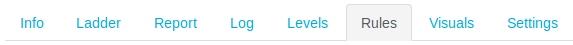

What we need to do now, is to tell the plugin that whenever a student complete's an activity, they should receive a fairly decent amount of points, say `100`. Click on the first __+ Add a rule__ option. This will add an empty condition set on top of all the other ones, like this:

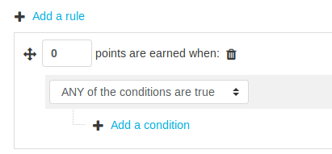

After changing the points to be earned to `100`, click on __+ Add a condition__ and select __Activity completion__. You will get this:

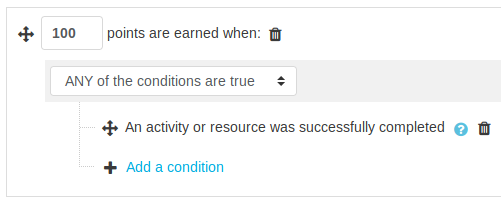

Now at this stage, whenever our students complete an activity, they will be receiving `100` points. In each activity you have control over more settings which dictates when an activity is deemed complete, for instance an activity can be marked as complete only when the student receives a passing grade. Refer to [Moodle documention](https://docs.moodle.org/en/Activity_completion) for more on this.

### Reward specific activities only

There are cases where you will want to only target a few activities, perhaps because they have more value in your course. So starting from our previous example, we will adapt the rule to reward our student when they complete the activity _Introduce yourself_ or the activity _Final quiz_.

First, let's start by adding a new sub group of conditions by clicking on __+ Add a condition__ and selecting __Set of conditions__. It is very important that the condition is set to __ANY of the conditions are true__, like so:

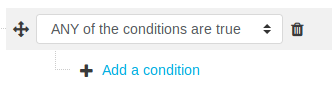

In this new set of conditions, we will add two __Activity or resource__ conditions, and in each of these we will select the activities mentioned above, namely _Introduce yourself_ and _Final quiz_. (Use the _+ Add a condition_ located within our new set of conditions).

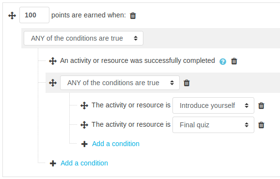

__Wait!__ We are not finished yet. There is a __major problem__ in our rule, can you spot it? Our first group of condition is not set-up properly, let's read the whole rule together.

```
Give 100 points to my students when:
  |
  |-- An activity or resource is completed
  |
  OR
  |
  |-- When:
       |
       |-- The activity is 'Introduce yourself'
       |
       OR
       |
       |-- The activity is 'Final quiz'

```

Our rule _An activity or resource is completed_ is not always required, because of the __OR__ statement. So if we leave the rule as is, our students will be rewarded for completing any activity, or for participating in our activities _Introduce yourself_ and _Final quiz_, this is not at all what we intended.

The bad _OR_ statement comes from the top group of conditions being set to _ANY of the conditions are true_. Instead, what we need is an __AND__, which we get by using __ALL of the conditions are true__. Like so:

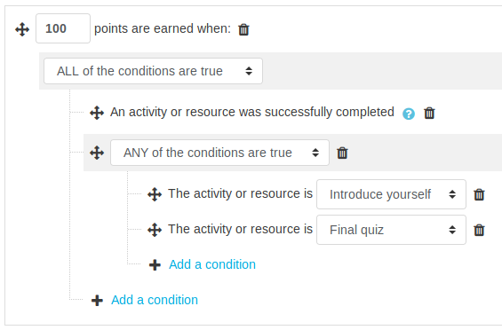

Which we can now read as:

```
Give 100 points to my students when:
  |
  |-- An activity or resource is completed
  |
  AND
  |
  |-- When:
       |
       |-- The activity is 'Introduce yourself'
       |
       OR
       |
       |-- The activity is 'Final quiz'

```

### Good to know

* Students are only rewarded for completing their activities once.
* Completing an activity with the failed status is ignored.

----

Course completion
-----------------

This features allows you to reward your students for completing a course. This is particularily useful when the plugin is used _For the whole site_, where points are gathered  for actions taken in any course. In order for _Course completion rewards_ to work, _Completion_ must be enabled in Moodle, [more help on this here](#how-to-enable-completion-in-moodle).

Navigate to the block's __rules page__.


We will create a new rule telling the plugin that whenever a student complete's a course, they should receive `250` points. Click on the first __+ Add a rule__ option. This will add an empty condition set on top of all the other ones, like this:


After changing the points to be earned to `250`, click on __+ Add a condition__ and select __Course completion__. And that's it, now your students will be rewarded for completing their courses.

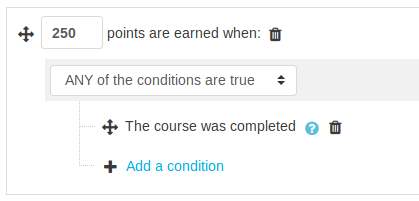


### Good to know

* Points are not awarded instantly, they require [Moodle cron](https://docs.moodle.org/en/Cron) to run.

----


Limit students rewards per day
------------------------------

To keep things under control, you may want to cap the amount of points your students can earn per day, or other time window. This can be useful to attempt to reduce the gaps between active and passive students.

For the sake of demonstration, let's decide to cap our students' maximum earnings to `250` points per day. Navigate to the block's __settings page__.

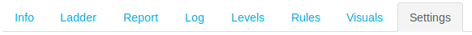

Scroll to the section __Cheat guard__. The setting we are interested in is __Max. points in time frame__. The first field contains the maximum number of points allowed, and the two following fields control the time window.

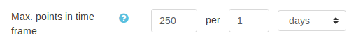

The above example shows how to limit to `250` per day.

### Good to know

* This setting could have a negative impact on your students' overall experience, as they may not understand why they stopped earning points, and be discouraged.
* A day is intepreted as _in the last 24 hours_, it is not reset at midnight. The same goes for other time windows.
* If the points to be given will exceed our limit, none are given. For example, if a student has already earned 240 out of 250 points in the last 24 hours, and performs an action weighted at 15 points, they will not be given any points.


----


Level badges themes
-------------------

It is important for your students to enjoy the badges displayed in the block, that is why you can upload your own images. In _Plus_, we offer you a bunch of additional badges ready for use. We called these __Badge themes__.

Navigate to the __Visuals__ page.

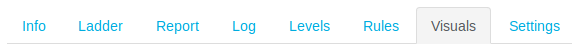

The dropdown for the setting __Level badges theme__ lists the different themes can you can pick from. By default, the theme is __Standard__ which displays the levels as a number within a star. Select another option to get a quick preview of some badges in the theme, as well as how many levels are included in that theme.

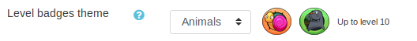

After saving the form, you can scroll down to the bottom of the page to discover a preview of all the badges.

### Custom badges

You can upload custom badges, to override specific badges, or to complement a theme when it does not include all the levels you are interested in. In the setting __Level badges override__ upload files named after the badge level you are uploading, for instance for the 3rd level, you would name your file `3.png` or `3.jpg`.

In the example below, I have uploaded a custom badge for the levels 2 and 4.

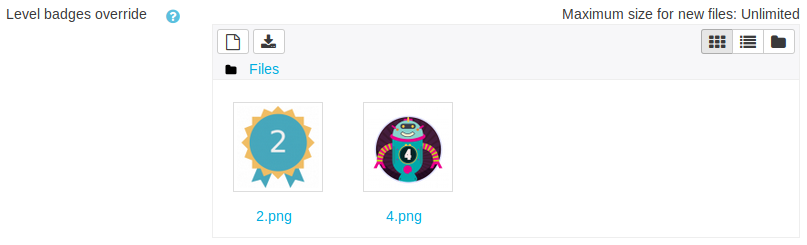

After saving the page, scroll to the bottom to discover a __preview__. My course contains 5 levels, I have selected the badge theme _Animals_ and set a custom badge for the levels 2 and 4.

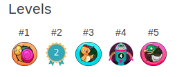

### Good to know

* Custom badges require images in the format PNG or JPG.
* You can use the Wikimedia repository to quickly search for images.
* Some badge themes do not include the level number on purpose. This reduces the emphasis on the numeral progression and instead plays on the motivation to discover what badge is next. Think of disabling the _Info page_ from the settings page if you want to hide the upcoming levels to your students.


----

Experience points substitution
------------------------------

While some of your group of students may be very familiar with the concept of _experience points_, it may not be the case for all of them. That's why _Plus_ comes with the ability to change the meaning of _experience points_ and replace it with any symbol you want.

In one of my courses which I have configured to reward students for their social participations in the forums, I will be using a __points symbol__ which they are very familiar with: the _thumb up_, or _like_. Now my students will earn _likes_ for being participative.

Let's navigate to the __Visuals__ page.


In the setting __Points symbol__, let's drag and drop our _thumb up_ image, just like so:

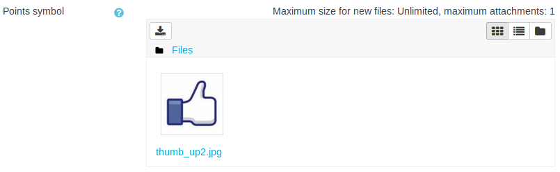

After saving the form, you can scroll down to the bottom of the page to discover a preview. As we can see below we went from using _experience points_ to _likes_.


### Good to know

* Varying badges and symbols between courses/semesters can help fight the monotony that can arise when re-using the same concepts with the same student groups.


----


Resilient cheat guard
---------------------

This feature is enabled by default as soon as you install _Level up! Plus_. No need to worry about students' trickeries any more, it's all taken care of automatically.


----

How to enable completion in Moodle
----------------------------------

Ensure that the setting `enablecompletion` is turned on. It is located in _Site administration > Advanced features > Enable completion tracking_.

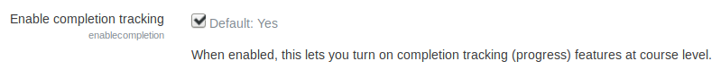

You will also need to enable it in your course. Visit your course's settings page, and locate _Completion tracking > Enable completion tracking_, it should be set to _Yes_.

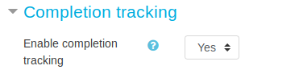

For more on completion, please refer to [Moodle documention](https://docs.moodle.org/en/Activity_completion).
